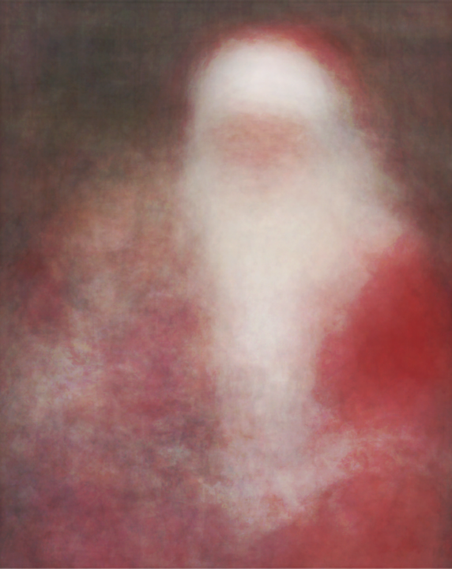
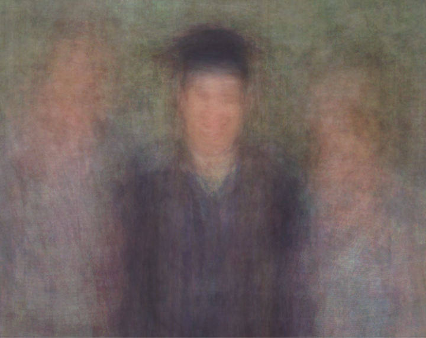

sir francis galton was a man ahead of his time. in 1906, he attended a livestock fair where there was a contest to guess the weight of an ox. over 800 people, from farmers to people with zero knowledge of livestock, took part in the competition. galton, however, decided to take the average of all guesses (1,197 pounds) and surprisingly ended up with the closest guess to the actual weight (1,198 pounds) of the ox out of all individual guesses, including experts.

this story is a famous example of how the collective knowledge of a large group can often provide more insight than individual expertise. let’s take a look at these two pictures from [jason salavon’s “100 special moments” photo collection](http://salavon.com/work/specialmoments/) where he took 100 unique photographs of special moments and averaged them.

    

        
    

    <i>kids with santa</i>

what do you see? well, there’s a really blurred image of santa. but, there’s more. we can tell that the right side of santa’s lap is relatively more blurred than the rest of the image - almost as if there’s a kid on the lap. furthermore, this alludes to the fact that most santas (or people in general) are right-handed, hence most kids sit on the right side of santa’s lap

    

        
    

    <i>the graduate</i>

what about this? the image suggests that there is a taller figure on the right side of the graduate while a shorter one is on the left. we can further decipher the right figure as the father (biologically, men tend to be taller) and the left as the mother. this uncovers the hidden trend that fathers usually stand to the right of their children during graduation shoots and mothers to the left.

the main idea here is that individual errors tend to cancel each other out, and the aggregate tends to be surprisingly accurate. this phenomenon highlights the many statistical and machine learning concepts, where aggregating predictions or measurements can produce robust, accurate results.

