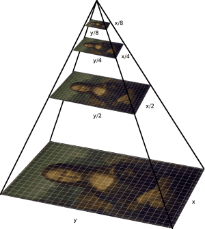

## background
[sergei mikhailovich prokudin-gorskii](https://en.wikipedia.org/wiki/Sergey_Prokudin-Gorsky) (1863-1944) traveled across the russian empire and captured photographs of everything! back then, there were no ways to print colored images, however, he was convinced that it would be possible someday in the future. from people and sculptures to buildings and trains, he recorded everything down on three glass plates with different exposures (red, green, and blue).

## overview
for this project, i use image processing techniques to take the digitized images prokudin-gorskii took, align them, and stack them together - basically recolorizing the images. this was done by the [library of congress](https://www.loc.gov/exhibits/empire/making.html).

before performing any sort of alignement, an important step of this process is to clean up any visual arjpgacts possible. this is crucial as it will create inaccuracies in our results when we perform caclulations in the later steps. to do this, i first divide the glass plate images into three equal parts **(r, g, b)** and then crop the borders by **10%**.

then, i will use one of the color channels (blue in my case) to act as an anchor while i shift the red and green channels around until they are all aligned.

### 1. single-scale search method
initially, i developed an algorithm which would exhaustively search a **[-15, -15]** pixels window of possible displacements. i would then calculate the normalized cross-correlation (ncc) to find the best score between the two images (blue and red/green) using the dot product of *im1/norm(im1) and im2/norm(im2)*. after that, i would take the displacement with the best ncc score and shift the image with respect to the blue image to align it nicely.

this method works well with lower resolution images (such as the .jpg images), however, when it comes to the larger resolution images (.tif images), this method proves to be computationally expensive as the search window would be much greater.

### 2. multi-scale pyramid search method

<i>image pyramid diagram with scaling factor 1/2</i>

<i>source: pyimagesearch</i>

to improve the efficiency of the algorithm, i implemented a new algorithm which uses an image pyramid. this algorithm basically scales down the original image multiple times to a coarser image where i can then use the single-scale search method and then slowly work our way up the pyramid shifting the images according to the displacement each time as i go.

this step is done recursively with a base case of *threshold=300px\*300px* and the search window becomes **[-2, 2]** pixels after the coarsest layer. the reason is because we would have already traversed up to a finer, shifted image (due to the *displacement \* 2* which is the scaling factor) where we would then only have to search a smaller neighborhood. in doing so, it significantly speeds up the computation time from an average of more than one minute to less than five seconds.

## results
- layout: original image, before alignment, after alignment
- displacements are in **(x, y)** format

  

    
    
    
  

  

    monastery.jpg 
    red channel:        (2, 3) 
    green channel:      (2, -3) 
    total time elapsed: 0.48s
  

  

    
    
    
  

  

    tobolsk.jpg 
    red channel:        (3, 6) 
    green channel:      (3, 3) 
    total time elapsed: 0.44s
  

  

    
    
    
  

  

    cathedral.jpg 
    red channel:        (3, 12) 
    green channel:      (2, 5) 
    total time elapsed: 0.43s
  

  

    
    
    
  

  

    emir.tif 
    red channel:        (-305, 93) 
    green channel:      (24, 49) 
    total time elapsed: 3.63s
  

  

    
    
    
  

  

    church.tif 
    red channel:        (-4, 58) 
    green channel:      (4, 25) 
    total time elapsed: 3.45s
  

  

    
    
    
  

  

    three_generations.tif 
    red channel:        (11, 112) 
    green channel:      (14, 53) 
    total time elapsed: 3.48s
  

  

    
    
    
  

  

    melons.tif 
    red channel:        (13, 178) 
    green channel:      (10, 81) 
    total time elapsed: 3.27s
  

  

    
    
    
  

  

    onion_church.tif 
    red channel:        (36, 108) 
    green channel:      (26, 51) 
    total time elapsed: 3.28s
  

  

    
    
    
  

  

    train.tif 
    red channel:        (32, 87) 
    green channel:      (5, 42) 
    total time elapsed: 3.25s
  

  

    
    
    
  

  

    icon.tif 
    red channel:        (23, 89) 
    green channel:      (17, 41) 
    total time elapsed: 3.28s
  

  

    
    
    
  

  

    self_portrait.tif 
    red channel:        (37, 176) 
    green channel:      (29, 78) 
    total time elapsed: 3.37s
  

  

    
    
    
  

  

    harvesters.tif 
    red channel:        (13, 124) 
    green channel:      (16, 59) 
    total time elapsed: 3.17s
  

  

    
    
    
  

  

    sculpture.tif 
    red channel:        (-27, 140) 
    green channel:      (-11, 33) 
    total time elapsed: 3.33s
  

  

    
    
    
  

  

    lady.tif 
    red channel:        (12, 111) 
    green channel:      (9, 51) 
    total time elapsed: 3.26s
  

