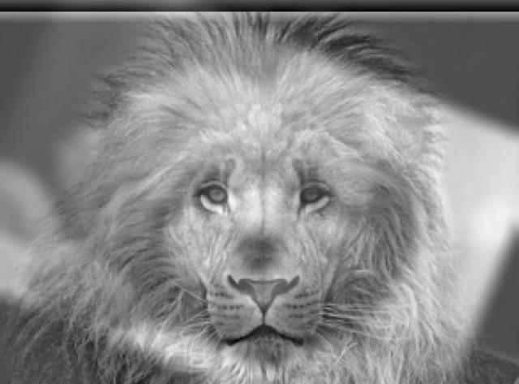
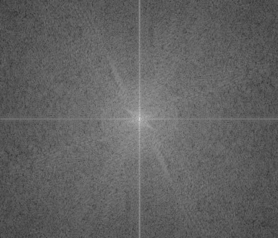
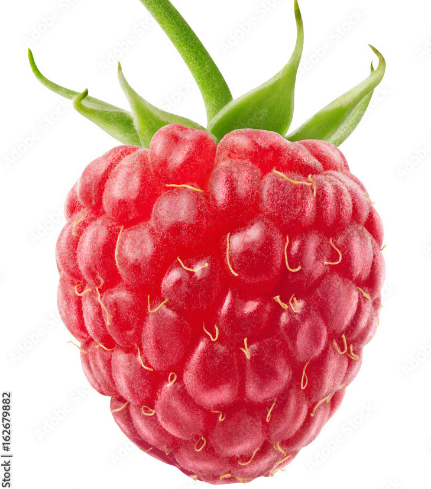

## fun with filters!

### 1.1 finite difference operators

let's take this cameraman as our example.

<div class="image-container">
    
    
    
</div>

*from left to right: original, dx, dy*


to get the images of dx and dy, i applied the finite difference operators *d_x* and *d_y* to create the find the edges where there is a sudden in image intensity. we can then combine this to find the edges.

<div class="image-container">
    
    
</div>

*from left to right: unbinarized edge image, binarized edge image*

you can see in the above images that we can combine the *d_x* and *d_y* images via the **gradient magnitude**:
```
grad = np.sqrt(np.square(part_x) + np.square(part_y))
```
to get an outline of the cameraman, or in other words, an edge image! the gradient magnitude essentially gives us the *edge strength* which takes into account the rapid increase in intensity w.r.t *x* and *y*. an additional step i did was binarize the image with *threshold = 0.3* to further highlight the edges and remove background noise (such as the lawn). but... we can do better.

### 1.2 derivative of gaussian (DoG) filter

if you zoom into the final images from **part 1.1**, we can see that the edges are not really clean - there is some aliasing. a solution for that is to use a gaussian filter! before calculating *d_x* and *d_y*, we can apply the gaussian filter to blur the image.

<div class="image-container">
    
    
</div>

*from left to right: original, blurred*

#### using 2 convolutions

<div class="image-container">
    
    
</div>

*from left to right: unbinarized, binarized (threshold = 0.07)*

the final image is a lot better! however, we can reduce one computational step by reducing 2 convolutions to 1.

#### using 1 convolution

<div class="image-container">
    
    
</div>

*from left to right: unbinarized, binarized (threshold = 0.01)*

you can see that the single convolution version is basically the same as the one with 2 convolutions. this is expected! the reason is because convolutions are associative and commutative.

### thoughts?

you can see that there is quite a big difference in the images when we apply the gaussian filter before computing the partial derivatives. smoothing/blurring the images prior to computation helps with the edge detection since it makes the edges more prominent in the sense that it removes jaggered edges from the image. you can see that the images produced from using the gaussian filter has smooth edges and no jaggered edges.

## fun with frequencies!

### 2.1 image sharpening

we can use gaussian filter for a wide variety of applications and one of it is image sharpening! when we apply the gaussian filter to an image, it retains all of the low frequencies. to "sharpen" an image, we can find all the high frequencies (details) by:
```
details = original - blurred
```
we can then use the details of the image, multiply it by a constant, alpha, and add it to the original image to create a "sharpened" effect.
```
sharpened = origina + alpha * details
```

#### taj mahal

original image:
<div class="image-container">
    
</div>

channel b: *blurred, details, sharpened*
<div class="image-container">
    
    
    
</div>

channel g: *blurred, details, sharpened*
<div class="image-container">
    
    
    
</div>

channel r: *blurred, details, sharpened*
<div class="image-container">
    
    
    
</div>

original vs sharpened image (alpha = 1):
<div class="image-container">
    
    
</div>

#### bikes

original image:
<div class="image-container">
    
</div>

channel b: *blurred, details, sharpened*
<div class="image-container">
    
    
    
</div>

channel g: *blurred, details, sharpened*
<div class="image-container">
    
    
    
</div>

channel r: *blurred, details, sharpened*
<div class="image-container">
    
    
    
</div>

original vs sharpened image (alpha = 1):
<div class="image-container">
    
    
</div>

### 2.2 hybrid images

hybrid images are created when a high-frequency image is overlayed on top of a low-frequency image. this creates the effect of seeing different images depending on how far you are from the image. when up close, the high frequency image is dominant and when far away, the low frequency image is dominant.

#### method

as suggested by [olivia et al.](http://olivalab.mit.edu/publications/OlivaTorralb_Hybrid_Siggraph06.pdf), a low-pass filter can be created using a standard 2-d gaussian filter. on the other hand, a high-pass filter can be created using the impulse filter minus the gaussian filter (gaussian-filtered image subtracted from original).

we then align these images (code already provided).

### results

#### human + cat:


<div class="image-container">
    
    
    
</div>

*left to right: human, cat, hybrid image*

<div class="image-container">
    
    
</div>

*left to right: aligned low-pass image (human), aligned high-pass image (cat)*

#### plane + hornbill:


<div class="image-container">
    
    
    
</div>

*left to right: plane, hornbill, hybrid image*

<div class="image-container">
    
    
</div>

*left to right: aligned low-pass image (plane), aligned high-pass image (hornbill)*

#### puppy + lion (failed):



<div class="image-container">
    
    
    
</div>

*left to right: puppy, lion, hybrid image*

<div class="image-container">
    
    
</div>

*left to right: aligned low-pass image (puppy), aligned high-pass image (lion)*

#### bicycle + motorbike:


<div class="image-container">
    
    
    
</div>

*left to right: bicycle, motorbike, hybrid image*

<div class="image-container">
    
    
</div>

*left to right: aligned low-pass image (bicycle), aligned high-pass image (motorbike)*

#### fourier analysis (bicycle + motorbike)

we can plot the fourier images of the different images using
```
plt.imshow(np.log(np.abs(np.fft.fftshift(np.fft.fft2(gray_image)))))
```

bicycle fourier vs bicycle fourier after low-pass:
<div class="image-container">
    
    
</div>
*you can see that after the low-pass, the frequency away from the center is less bright meaning that the high frequencies are removed.*

motorbike fourier vs motorbike fourier after high-pass:
<div class="image-container">
    
    
</div>
*on the other hand, the center has a small dark spot and it is bright throughout the outer parts of the image, meaning that the high frequencies are retained.*

hybrid fourier:
<div class="image-container">
    
</div>

## multi-resolution blending

### 2.3 gaussian and laplacian stacks

different from an image pyramid, we can use a stack instead to produce similar results by using the gaussian filter to blur the images instead of downsampling. we can then use this technique to get the different frequencies of images and blend them together seemlessly!

#### the oraple (orange + apple)

original apple, original orange, final image
<div class="image-container">
    
    
    
</div>

laplacian stack


*first three rows are levels 0, 2, 4 of the laplacian stack. last row is the images combined*

oraple masks


*masks of levels 0 to 5 of the laplacian stack from left to right*

#### a berry

original strawberry, original rasberry, final image
<div class="image-container">
    
    
    
</div>

laplacian stack


*first three rows are levels 0, 2, 4 of the laplacian stack. last row is the images combined*

oraple masks


*masks of levels 0 to 5 of the laplacian stack from left to right*

### paffle (pancake + waffle)

original pancake, original waffle, final image
<div class="image-container">
    
    
    
</div>

laplacian stack


*first three rows are levels 0, 2, 4 of the laplacian stack. last row is the images combined*

oraple masks


*masks of levels 0 to 5 of the laplacian stack from left to right*

### blane (bird + plane) using an irregular mask

using the same hornbill and plane image from the hybrid images section, i will repurpose it to blend it together

original hornbill, original plane, final image
<div class="image-container">
    
    
    
</div>

this is the irregular mask used for masking


laplacian stack


*first three rows are levels 0, 2, 4 of the laplacian stack. last row is the images combined*

oraple masks


*masks of levels 0 to 5 of the laplacian stack from left to right*

### bells & whistles
* used color to enhance the blending effect

<style>
    .image-gallery {
        max-width: 100%;
        overflow-x: auto;
        text-align: center;
    }
    
    .image-container {
        display: inline-flex;
        jusjpgy-content: center;
        gap: 10px;
        padding: 10px;
        max-width: 100%;
    }
    
    .image-container img {
        height: 220px; /* Adjust this value as needed */
        width: auto;
        object-fit: contain;
    }
    
    @media (max-width: 768px) {
        .image-container {
        flex-direction: column;
        align-items: center;
        }
        
        .image-container img {
        max-width: 100%;
        height: auto;
        }
    }
</style>