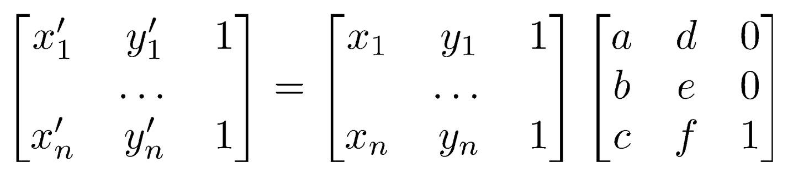
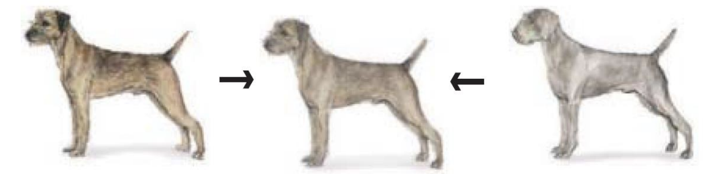

<div class="image-wrapper">
    <div class="image-container">
        
        
        
    </div>
</div>
<div class="image-wrapper">
    <i>original kanye face, final morphed result, original thomas face</i>
</div>

## overview

the aim of this project is to morph my face to another person's face - in this case, [kanye west](https://en.wikipedia.org/wiki/Kanye_West). this will require two main parts: warping the image shape and cross-dissolve of the image colors. the cross-dissolve is the easy part, but warping the different faces to the shape requires a little more work. warping utilizes corresponding points on the features of both faces, triangulates it, and warps/morphs the individual triangles to a control shape depending on a constant [0,1]. 

## part 1: defining correspondences

first, i labeled all of the points using [this tool](https://cal-cs180.github.io/fa23/hw/proj3/tool.html). the triangulations for both images using the [delaunay](https://docs.scipy.org/doc/scipy/reference/generated/scipy.spatial.Delaunay.html) triangulation function.

<div class="image-wrapper">
    <div class="image-container">
        
        
    </div>
</div>
<div class="image-wrapper">
    <i>168 triangles formed by delaunay triangulation</i>
</div>

## part 2: computing the mid-way face

<div class="image-wrapper">
    <div class="image-container">
        
    </div>
</div>
<div class="image-wrapper">
    <i>morphing two different dogs into the average shape</i>
</div>

i used inverse warping to warp both images to an average shape so that we can cross-dissolve both images to a mid-way face. here are the steps for computing the mid-way face:

1. compute the average shape of both faces
2. warping both faces into that shape
3. average colors together

to perform inverse warping, we need to find the affine transformation matrix for each triangle for both images. 

### affine transformation matrix

<div class="image-wrapper">
    <div class="image-container">
        
    </div>
</div>

we can solve for T from the equation above `im' = im * T`. then, we can use inverse T to warp the faces to the average shape.

<div class="image-wrapper">
    <div class="image-container">
        
        
    </div>
</div>
<div class="image-wrapper">
    <div class="image-container">
        
        
    </div>
</div>
<div class="image-wrapper">
    <i>both faces warped into the average shape</i>
</div>

you can see that the triangulation in both images are the same.

### cross-dissolve

<div class="image-wrapper">
    <div class="image-container">
        
    </div>
</div>
<div class="image-wrapper">
    <i>cross-dissolving two average-shaped dog</i>
</div>

<div class="image-wrapper">
    <div class="image-container">
        
        
        
    </div>
</div>
<div class="image-wrapper">
    <i>warped face of kanye, cross-dissolved mid-way face, warped face of me</i>
</div>

you can see that after warping the faces to the average shape then performing cross-dissolve on both faces, the mid-way face comes out pretty well.

## part 3: the morph sequence

<div class="image-wrapper">
    <div class="image-container">
        
    </div>
</div>
<div class="image-wrapper">
    <div class="image-container">
        
    </div>
</div>
<div class="image-wrapper">
    <i>all 45 frames of the morph sequence</i>
</div>

you can see that in the morph sequence the first frame is `alpha = 0.00` and `alpha = 1.00` for the last frame. alpha 0 and 1 are both the original faces (images).

## part 4: the mean face of a population

the images i used for this part are from the [FEI face database](https://fei.edu.br/~cet/facedatabase.html)

<div class="image-wrapper">
    <div class="image-container">
        
    </div>
</div>
<div class="image-wrapper">
    <i>the dataset: <strong>100 smiling men</strong> from th FEI face database</i>
</div>

performing what we did in part 2 but for multiple multiple faces instead of two faces, we can get the average face shape of the 100 men. this is what it looks like:

<div class="image-wrapper">
    <div class="image-container">
        
    </div>
</div>
<div class="image-wrapper">
    <i>the mean face</i>
</div>

after that, i warped all of the faces to the mean shape. here are some examples:

<div class="image-wrapper">
    <div class="image-container">
        
    </div>
</div>
<div class="image-wrapper">
    <i>original vs warped faces</i>
</div>

you can see that the most noticeable differences are in the eyes.

i then warped my face to the average:

<div class="image-wrapper">
    <div class="image-container">
        
    </div>
</div>

which looks... really weird.

similarly, i warped the average face to my face shape:

<div class="image-wrapper">
    <div class="image-container">
        
    </div>
</div>

## part 5: caricatures - extrapolating from the mean

below are caricatures of my face by extrapolating from the mean from part 4. i chose alpha values that are outside the range [0,1] to emphasize certain features of my face. here is the equation i used:

```
caricature_points = alpha * (points_thomas - points_avg) + points_avg
```

<div class="image-wrapper">
    <div class="image-container">
        
        
        
    </div>
</div>
<div class="image-wrapper">
    <i>alpha = 1.25, alpha = 2, alpha = -1</i>
</div>

## bells and whistles
**(!)** watch the video below in **fullscreen** to watch the evolution of music!

<video width="600" height="400" controls>
  <source src="bnw_results/final.mp4" type="video/mp4">
</video>

<style>
    .image-gallery {
        max-width: 100%;
        overflow-x: auto;
        text-align: center;
    }
    
    .image-container {
        display: inline-flex;
        justify-content: center;
        gap: 10px;
        padding: 10px;
        max-width: 100%;
        text-align: center;
    }
    
    .image-container img {
        height: 220px; /* Adjust this value as needed */
        width: auto;
        object-fit: contain;
    }
    
    .image-wrapper {
        text-align: center; /* Ensures everything inside is centered */
        width: 100%;
    }

    @media (max-width: 768px) {
        .image-container {
        flex-direction: column;
        align-items: center;
        }
        
        .image-container img {
        max-width: 100%;
        height: auto;
        }
    }
</style>