## setup

for this project, we will be using the [deepfloyd if](https://huggingface.co/docs/diffusers/api/pipelines/deepfloyd_if) diffusion model. trained by *stability ai*, it is a two stage model where the first stage produces images of size *64 x 64* and second takes the outputs of the first stage as input to produce *256 x 256* sized images.

link to [DeepFloyd/IF-I-XL-v1.0](https://huggingface.co/DeepFloyd/IF-I-XL-v1.0).

**the seed i will be using for the project: 34224309**

below are some images i generated using different prompts.

### prompt: 'a man wearing a hat'

    

        
        
        
    

    <i>(left to right) num_inference_steps=20, 50, 100 respectively</i>

### prompt: 'an oil painting of a snowy mountain village'

    

        
        
        
    

    <i>(left to right) num_inference_steps=20, 50, 100 respectively</i>

### prompt: 'a rocket ship'

    

        
        
        
    

    <i>(left to right) num_inference_steps=20, 50, 100 respectively</i>

### reflection of the images

for all of the different prompts, the images with higher number of inference steps tend to be higher quality. though the trade-off is efficieny (time to generate), the images are more intricate. for example, for the prompt 'a man wearing a hat', you can see that for *num_inference_steps=20*, the man looks hyper realistic whereas the man in the image for *num_inference_steps=100* looks more real.

## implementing the forward process

i implemented `noisy_im = forward(im, t)` function which adds noise to an image for timestep t. t in this case is [0, 999] where a higher t produces a noisier image than a lower t.

using the function, i run an image of the berkeley campanile through it for *t=[250, 500, 750]*

### original image of berkeley campanile

    

        
    

### noisy images of berkeley campanile

    

        
        
        
    

    <i>(left to right) t=250, t=500, t=750</i>

you can see that as the timestep t grows larger, we get more noise on the image!

## classical denoising

the classical way to denoise an image is to apply gaussian blurring on the images. let's try that:

### gaussian blur denoising

    

        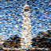
        
        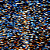
    

    <i>(left to right) t=250, t=500, t=750</i>

you can see that it didn't really work. the iamges are just blurry and we do not get the original image back.

## one-step denoising

now, let's use the pretrained diffusion model to help us denoise. we can use the UNet to estimate the noise and try denoising it. this can be done by passing the noisy image through the `stage_1.unet`.

### t=250

    

        
        
        
    

    <i>the original image, the noisy image, and the estimated original image</i>

### t=500

    

        
        
        
    

    <i>the original image, the noisy image, and the estimated original image</i>

### t=750

    

        
        
        
    

    <i>the original image, the noisy image, and the estimated original image</i>

you can see that the results are way better using this one-step approach compared to the gaussian blur! however, we notice that the estimated original image is quite similar to the ground truth but it's not quite there. this is not unexpected, since the noise we retrieved from the unet is only an estimate!

another observation is that the higher the timestep, the more the estimated original image deviates from the ground truth image. this is because with more noise, it is harder for us to retrieve the original image, since we are working with a harder problem.

## iterative denoising

the one-step approach is a significant improvement from the classical denoising method, but we can do better. in theory, instead of finding the estimated noise in 'one shot', we can iteratively find the estimated noises from one timestep t to t' in smaller steps to get a more accurate estimate of our noise.

one way to do this is to start with the noisy image at time t=1000 (noisiest), denoise for one step to get the image at t=999 and continue to t=0. however, this would require to run the diffusion model 1000 times, which is **slow and expensive**. to fix this, we use strided time steps (a stride of 30 in our case).

to achieve this, we use equations 6 and 7 from the [ddpm paper](https://arxiv.org/pdf/2006.11239) to help us with this task.

in this part, i implement the `iterative_denoise(image, i_start)` function which takes a noisy image `image`, and a starting index `i_start`. this function denoises an image starting at timestep `timestep[i_start]`.

    

        
    

    <i>iterative denoising formula</i>

    

        
    

    <i>variables</i>

below are results of the noisy images of the campanile every 5th loop of denoising (it should gradually become less noisy the smaller t is)

### noisy campanile images with iterative denoising 

    

        
        
        
        
        
    

    <i>(left to right) t=690, t=540, t=390, t=240, t=90</i>

    

        
        
        
        
    

    <i>(left to right) original, iterative, one-step, gaussian blurred</i>

## diffusion model sampling

other than using `iterative_denoising` to denoise an image, we can use it to generate images from scratch. we can set `i_start=0` and pass in random noise - pure noise. below are the results of 5 images of "a high quality photo":

    

        
        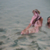
        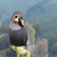
        
        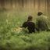
    

    <i>images generated from purely random noise using torch.randn</i>

you can see that the we get really cool images! though they are not necessarily "high quality" per se, we do get something from just pure noise which is awesome.

## classifier-free guidance (cfg)

the issue with generating images from pure noise is that some images don't really mean anything - you can't really tell what's going on in the images. we can improve the quality of the images (at the expense of diversity) through a technique called [classifier-free guidance](https://arxiv.org/abs/2207.12598).

we implement `iterative_denoise_cfg()` function and show 5 images of "a high quality photo" with scale=7:

    

        
        
        
        
        
    

    <i>images generated with iterative_denoise_cfg</i>

you can see that the images are a lot more realistic (and make more sense)!

## image-to-image translation

previously, we took a real image, added noise, and denoised it, essentially making edits to existing images. this works beacuse the diffusion model "hallucinates" when denoising an image which forces it to "edit" the image in creative ways; the larger the noise, the larger the edits.

now, let's try to take an original test image, noise it a little and force it back onto the image manifold without any conditioning; we should get an image similar to the original image. this followed the [SDEdit](https://sde-image-editing.github.io/) algorithm.

to do this, we:
1. run the forward process to get a noisy test image
2. run `iterative_denoise_cfg` function using a starting index of [1, 3, 5, 7, 10, 20] steps. the result should be a series of "edits" to the original image which matches the original image closer and closer as `i_start` grows big.

    

        
    

    <i>force image x_t to have same pixels as x_orig where m=0</i>

### sather gate

    

        
    

    <i>original image</i>

    

        
        
        
        
        
        
    

    <i>SDEdit with i_start=[1, 3, 5, 7, 10, 20] respectively</i>

### rock

    

        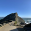
    

    <i>original image</i>

    

        
        
        
        
        
        
    

    <i>SDEdit with i_start=[1, 3, 5, 7, 10, 20] respectively</i>

## editing hand-drawn and web images

we can try the same thing with images from the web and our own drawings

### web image: drake's album cover 'for all the dogs'

    

        
    

    <i>original image</i>

    

        
        
        
        
        
        
    

    <i>SDEdit with i_start=[1, 3, 5, 7, 10, 20] respectively</i>

### handrawn image 1: plane in the sky

    

        
    

    <i>original image</i>

    

        
        
        
        
        
        
    

    <i>SDEdit with i_start=[1, 3, 5, 7, 10, 20] respectively</i>

### handrawn image 2: two lovely flowers

    

        
    

    <i>original image</i>

    

        
        
        
        
        
        
    

    <i>SDEdit with i_start=[1, 3, 5, 7, 10, 20] respectively</i>

## inpainting

using the same procedure, we can perform inpainting which follows the [RePaint](https://arxiv.org/abs/2201.09865) paper. to do this, we create a mask over an area of the image and set it to 1 (the portion we want to edit/generate new content) and 0 elsewhere. we then run the diffusion denoising loop. but, for every step, we force the original image where mask, **m**, is 0.

### campanile

    

        
        
        
        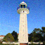
    

    <i>(left to right) original, mask, hole to fill, inpainted</i>

### sather gate

    

        
        
        
        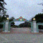
    

    <i>(left to right) original, mask, hole to fill, inpainted</i>

### rock

    

        
        
        
        
    

    <i>(left to right) original, mask, hole to fill, inpainted</i>

i had to run the diffusion model a couple of times since it was not trained for this specific task. after a few tries, i got some nice results!

## text-conditioned image-to-image translation

we can do the same thing but instead of giving it the prompt "a high quality photo", we can use different prompts! this will guide the projection of the generated image rather than just a projection onto the natural image manifold.

we use different noise levels for each prompt [1, 3, 5, 7, 10, 20] which should give us an image that is a closer representation of the original image the higher up we go.

### prompt: "a rocket ship"

    

        
        
        
    

    <i>(left to right) original, mask, hole to fill</i>

    

        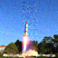
        
        
        
        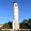
        
    

    <i>(left to right) noise_level = 1, 3, 5, 7, 10, 20</i>

### prompt: "a man wearing a hat"

    

        
        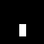
        
    

    <i>(left to right) original, mask, hole to fill</i>

    

        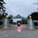
        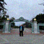
        
        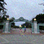
        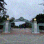
        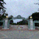
    

    <i>(left to right) noise_level = 1, 3, 5, 7, 10, 20</i>

this one is slightly harder to tell, especially for higher noise levels, due to the mask being smaller compared to the rocket ship. it is expected that for higher noise levels that the figure of the man slowly disappears since it is meant to resemble the original picture more and more. 

however, we do see int he first few images that we get a figure standing in the center of the image - almost as if they are posing for a picture under sather gate!

it is really hard to tell if the man is actually wearing a hat due to the scale of the images.

### prompt: "a pencil"

    

        
        
        
    

    <i>(left to right) original, mask, hole to fill</i>

    

        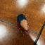
        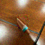
        
        
        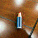
        
    

    <i>(left to right) noise_level = 1, 3, 5, 7, 10, 20</i>

overall, good results!

## visual angrams

one cool thing we can do with diffusion models is that we can create [visual angrams](https://dangeng.github.io/visual_anagrams/).

to do this, we can denoise the image *x_t* with the first prompt, to obtain the first noise. we can then flip *x_t* upside down and denoise the next image to get the second noise. we then flip the second noise back, making sure it is upright. we then average both noises. lastly, perform denoising + diffusion.

    

        
    

    <i>the full algorithm</i>

### prompts: "an oil painting of people around a campfire" + "an oil painting of an old man"

    

        
        
    

### prompts: "an oil painting of people around a campfire" + "an oil painting of an old man" (v2)

    

        
        
    

### prompts: "an oil painting of people around a campfire" + "a photo of a dog"

    

        
        
    

### prompts: "an oil painting of people around a campfire" + "a photo of a dog" (v2)

    

        
        
    

### prompts: "an oil painting of a snowy mountain village" + "an oil painting of an old man"

    

        
        
    

### prompts: "an oil painting of a snowy mountain village" + "an oil painting of an old man" (v2)

    

        
        
    

## hybrid images

we can create hybrid images similar to the way above. to do this, we implement [factorized diffusion](https://arxiv.org/abs/2404.11615). 

    

        
    

    <i>the full algorithm</i>

### prompt: "a lithograph of waterfalls" + "a lithograph of a skull" x2

    

        
        
    

    

        
        
    

    <i>image zoomed in (waterfall) vs image zoomed out (skull)</i>

### prompt: "a peacock" + "a forest"

    

        
        
    

    <i>image zoomed in (forest) vs image zoomed out (peacock)</i>

### prompt: "a lithograph of an elephant" + "a lithograph of istanbul"

    

        
        
    

    <i>image zoomed in (istanbul) vs image zoomed out (elephant)</i>

## reflection

this project was incredible cool, especially the visual angrams. i feel like even for a human artist, it is quite hard to come up with these visual angrams but it takes the diffusion model just a couple of seconds. it is also really interesting what sorts of new content the diffusion model comes up with!

