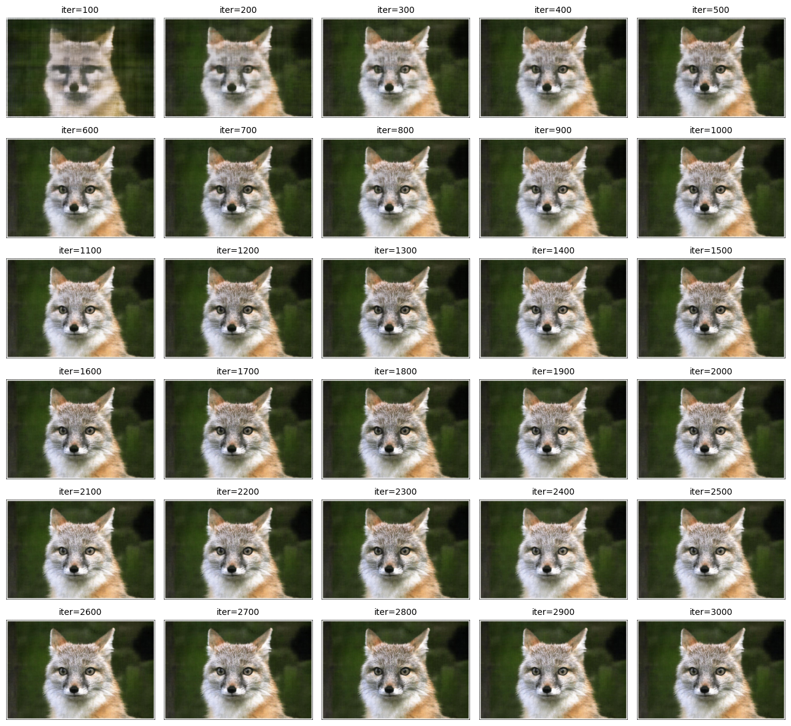
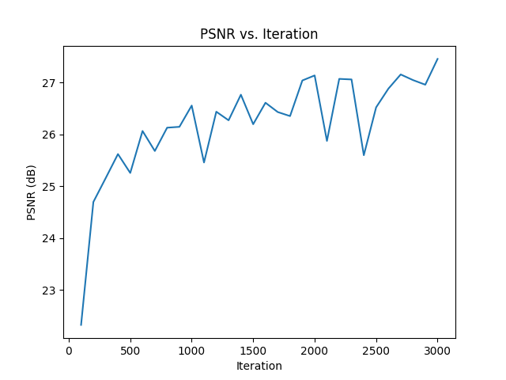
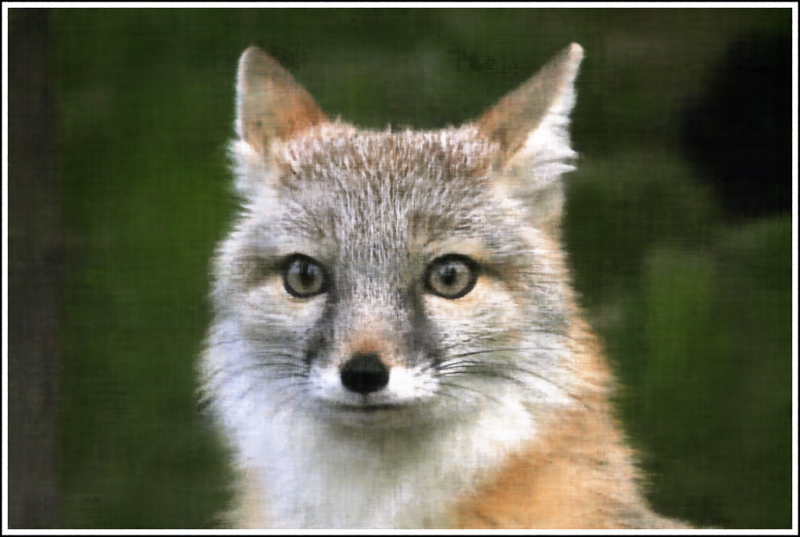
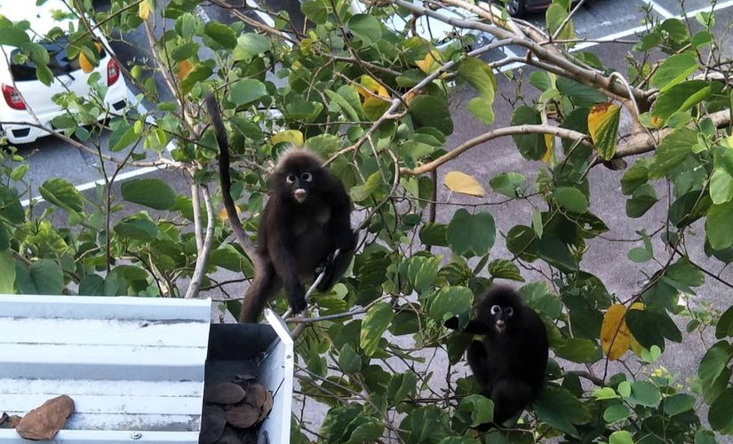
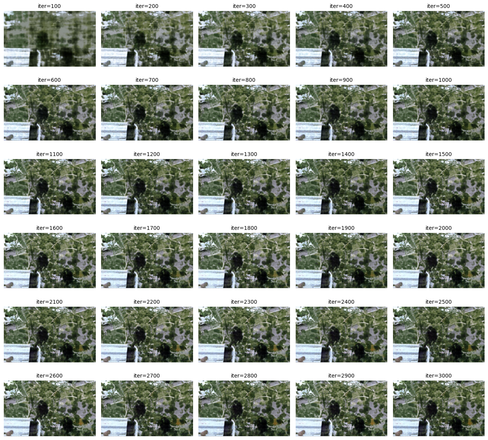
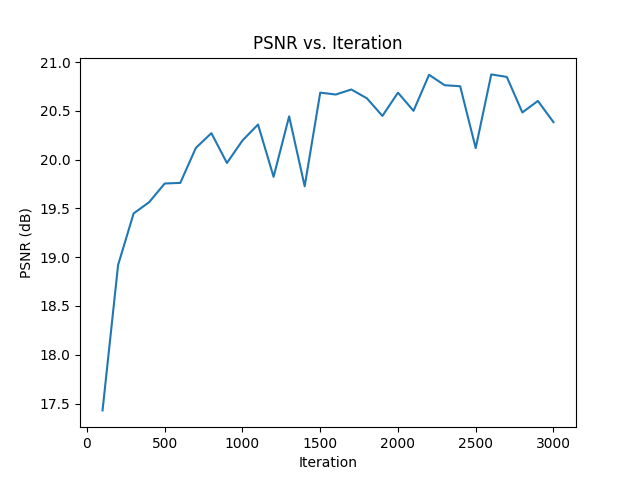
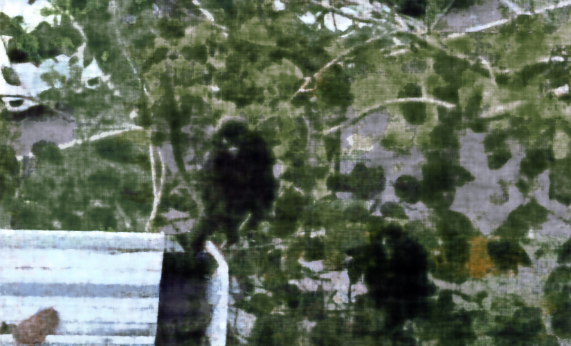

this project explores neural fields, specifically [neural radiance fields (NeRF)](https://www.matthewtancik.com/nerf), as a method for representing 2d and 3d spaces. starting with a 2d example, we optimize a neural field to recreate an image, demonstrating the foundational concepts behind NeRF.

## part 1: fit a neural field to a 2d image

in this part, i implement a multilayer perceptron (MLP) network with sinusoidal positional encoding (PE), taking in 2-dim pixel coordinates and output the 3-dim pixel colors.

<div class="image-wrapper">
    <div class="image-container">
        
    </div>
</div>
<div class="image-wrapper">
    <i>multilayer perceptron (MLP)</i>
</div>

training settings:
```
model = MLP().to(device)
criterion = nn.MSELoss()
optimizer = optim.Adam(model.parameters(), lr=1e-2)
batch_size = im_w * im_h
iters = 3000
```

### sample image 1: fox

<div class="image-wrapper">
    <div class="image-container">
        
    </div>
</div>
<div class="image-wrapper">
    <i>an image of a fox (original)</i>
</div>

<div class="image-wrapper">
    <div class="image-container">
        
    </div>
</div>
<div class="image-wrapper">
    <i>iterations</i>
</div>

<div class="image-wrapper">
    <div class="image-container">
        
    </div>
</div>
<div class="image-wrapper">
    <i>psnr across iterations</i>
</div>

<div class="image-wrapper">
    <div class="image-container">
        
        
    </div>
</div>
<div class="image-wrapper">
    <i>original vs final image</i>
</div>

we can see that the final image generated by the mlp is a little darker than the original image. other than that, it looks pretty good!

### sample image 2: langurs

<div class="image-wrapper">
    <div class="image-container">
        
    </div>
</div>
<div class="image-wrapper">
    <i>an image of a langurs (original)</i>
</div>

<div class="image-wrapper">
    <div class="image-container">
        
    </div>
</div>
<div class="image-wrapper">
    <i>iterations</i>
</div>

<div class="image-wrapper">
    <div class="image-container">
        
    </div>
</div>
<div class="image-wrapper">
    <i>psnr across iterations</i>
</div>

<div class="image-wrapper">
    <div class="image-container">
        
        
    </div>
</div>
<div class="image-wrapper">
    <i>original vs final image</i>
</div>

similar to the first image, the final image is darker than the original image. this image is slightly blurrier too. we can also see from our plot that the overall psnr is lower compared to the fox image. nonetheless, looks good.

### hyperparameter tuning

let's see if things change if we slightly alter the parameters. for this part i:
1. remove a fully connected layer + relu
2. change parameter *L=10* to *L=6*

<div class="image-wrapper">
    <div class="image-container">
        
    </div>
</div>
<div class="image-wrapper">
    <i>iterations</i>
</div>

<div class="image-wrapper">
    <div class="image-container">
        
        
    </div>
</div>
<div class="image-wrapper">
    <i>original vs final image</i>
</div>

we see that the results are essentially the same! not much has changed.

## part 2: fit a neural field from multi-view images

through inverse rendering from multi-view calibrated images, we can represent 3d space using a neural radiance field. we will be using the lego scene from the [original NeRF paper](https://www.matthewtancik.com/nerf)

### create rays from cameras


<style>
    .image-gallery {
        max-width: 100%;
        overflow-x: auto;
        text-align: center;
    }
    
    .image-container {
        display: inline-flex;
        justify-content: center;
        gap: 10px;
        padding: 10px;
        max-width: 100%;
        text-align: center;
    }
    
    .image-container img {
        height: 220px; /* Adjust this value as needed */
        width: auto;
        object-fit: contain;
    }
    
    .image-wrapper {
        text-align: center; /* Ensures everything inside is centered */
        width: 100%;
    }

    @media (max-width: 768px) {
        .image-container {
        flex-direction: column;
        align-items: center;
        }
        
        .image-container img {
        max-width: 100%;
        height: auto;
        }
    }
</style>