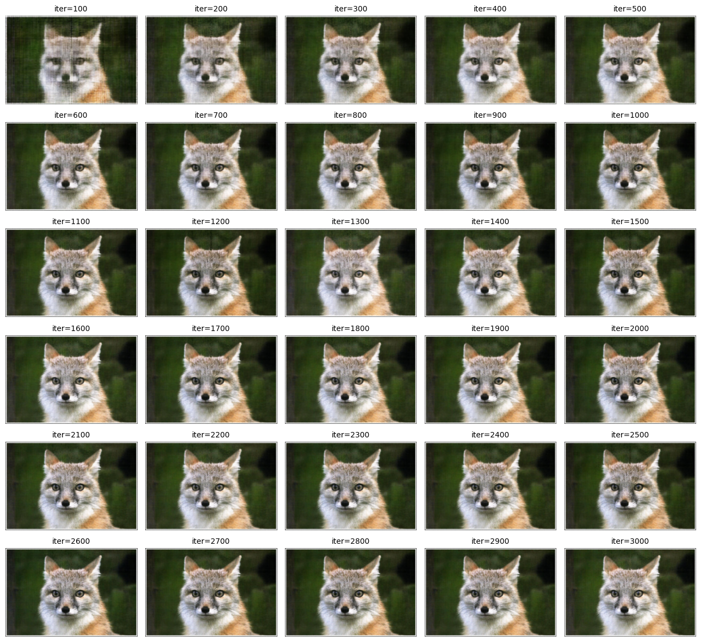

this project explores neural fields, specifically [neural radiance fields (NeRF)](https://www.matthewtancik.com/nerf), as a method for representing 2d and 3d spaces. starting with a 2d example, we optimize a neural field to recreate an image, demonstrating the foundational concepts behind NeRF.

## part 1: fit a neural field to a 2d image

in this part, i implement a multilayer perceptron (MLP) network with sinusoidal positional encoding (PE), taking in 2-dim pixel coordinates and output the 3-dim pixel colors.

<div class="image-wrapper">
    <div class="image-container">
        
    </div>
</div>
<div class="image-wrapper">
    <i>multilayer perceptron (MLP)</i>
</div>

training settings:
```
model = MLP().to(device)
criterion = nn.MSELoss()
optimizer = optim.Adam(model.parameters(), lr=1e-2)
batch_size = im_w * im_h
iters = 3000
```

### sample image 1: fox

<div class="image-wrapper">
    <div class="image-container">
        
    </div>
</div>
<div class="image-wrapper">
    <i>an image of a fox (original)</i>
</div>

<div class="image-wrapper">
    <div class="image-container">
        
    </div>
</div>
<div class="image-wrapper">
    <i>iterations</i>
</div>

<div class="image-wrapper">
    <div class="image-container">
        
    </div>
</div>
<div class="image-wrapper">
    <i>psnr across iterations</i>
</div>

<div class="image-wrapper">
    <div class="image-container">
        
        
    </div>
</div>
<div class="image-wrapper">
    <i>original vs final image</i>
</div>

we can see that the final image generated by the mlp is a little darker than the original image. other than that, it looks pretty good!

### sample image 2: langurs

<div class="image-wrapper">
    <div class="image-container">
        
    </div>
</div>
<div class="image-wrapper">
    <i>an image of a langurs (original)</i>
</div>

<div class="image-wrapper">
    <div class="image-container">
        
    </div>
</div>
<div class="image-wrapper">
    <i>iterations</i>
</div>

<div class="image-wrapper">
    <div class="image-container">
        
    </div>
</div>
<div class="image-wrapper">
    <i>psnr across iterations</i>
</div>

<div class="image-wrapper">
    <div class="image-container">
        
        
    </div>
</div>
<div class="image-wrapper">
    <i>original vs final image</i>
</div>

similar to the first image, the final image is darker than the original image. this image is slightly blurrier too. we can also see from our plot that the overall psnr is lower compared to the fox image. nonetheless, looks good.

### hyperparameter tuning

let's see if things change if we slightly alter the parameters. for this part i:
1. remove a fully connected layer + relu
2. change parameter *L=10* to *L=6*

<div class="image-wrapper">
    <div class="image-container">
        
    </div>
</div>
<div class="image-wrapper">
    <i>iterations</i>
</div>

<div class="image-wrapper">
    <div class="image-container">
        
        
    </div>
</div>
<div class="image-wrapper">
    <i>original vs final image</i>
</div>

we see that the results are essentially the same! not much has changed.

## part 2: fit a neural field from multi-view images

through inverse rendering from multi-view calibrated images, we can represent 3d space using a neural radiance field. we will be using the lego scene from the [original NeRF paper](https://www.matthewtancik.com/nerf)

### create rays from cameras

#### camera to world coordinate conversion  
the `transform` function converts camera coordinates *x_c* to homogeneous coordinates by appending 1. using `torch.matmul`, these coordinates are batch-multiplied by the camera-to-world matrix *c2w*. the results are normalized by the last coordinate *w*.

#### pixel to camera coordinate conversion  
the `pixel_to_camera` function reshapes and converts input *u*, *v* pixel coordinates into homogeneous coordinates. the camera intrinsic matrix *k* is inverted with `torch.inverse` and used to map the homogeneous pixel coordinates to camera coordinates. the result is scaled by the input depth *s* to produce *x_c*.

#### pixel to ray conversion  
the `pixel_to_ray` function computes the world-to-camera matrix *w2c* as the inverse of *c2w*. from *w2c*, rotation *r_inv* and translation *t* are extracted to compute ray origins *r_o = -r_inv * t*. to calculate ray directions *r_d*, pixel-to-camera and camera-to-world transformations are applied, and the normalized vector difference *x_w - r_o* is computed.

### sampling

#### sampling rays from images  
to sample rays from images, i flattened all the pixels from all the images and performed global sampling to get *n* rays from all images. i created a torch dataset called `RaysData` to hold these sampling functions. i included a function `sample_rays` which takes the number of rays *n* as an input parameter. i made sure to add 0.5 to all the *uv* coordinates so they sit in the center of the pixels. i call `pixel_to_ray` on my sampled *uv* values to get the sampled *r_o* and *r_d*.

#### sampling points along rays  
i also implemented a function `samples_along_rays` which takes *r_o* and *r_d* as input. it also has metadata parameters including *n_samples=32*, *near=2.0*, *far=6.0*, and *perturb=True*. in this function, i uniformly create samples along the ray (stored in *t*). if *perturb* is true, i perturb the samples by a random amount. finally, i compute the final samples according to the formula *x = r_o + r_d * t*.

### putting the dataloading together

i used the provided code (with adjustments) to make sure everything looked good.

<div class="image-wrapper">
    <div class="image-container">
        
        
    </div>
</div>

### neural radiance field

i implemented a multilayer perceptron (mlp) to predict both the density and color of 3d points in the radiance field. the network takes 3d world coordinates and view directions as input, applies positional encoding, and uses a deeper architecture with mid-layer concatenation to effectively optimize the 3d representation. i followed the following architecture:

<div class="image-wrapper">
    <div class="image-container">
        
    </div>
</div>

training settings:
```
model = MLP().to(device)
optimizer = optim.Adam(model.parameters(), lr=1e-3)
criterion = nn.MSELoss()
batch_size = 10000
iters = 3000
```

i implemented the volume rendering equation to compute the final color of rays by integrating over the density and color predicted by the network. the process involves calculating the transmittance along the ray, the opacity at each sample, and accumulating the color contributions from each sample. using pytorch, the implementation supports backpropagation by leveraging operations like `torch.cumsum` and `torch.cumprod`. this allows the network to be optimized end-to-end for tasks like novel view synthesis and depth estimation.

<div class="image-wrapper">
    <div class="image-container">
        
    </div>
</div>
<div class="image-wrapper">
    <i>from the project specifications</i>
</div>

### results

here are images of novel views from c2w_val generated by the nerf, with different numbers of epochs. to render an image from a single camera view, ray origins and ray directions are calculated for each pixel in the camera view.

<div class="image-wrapper">
    <div class="image-container">
        
        
        
        
    </div>
</div>

<div class="image-wrapper">
    <div class="image-container">
        
        
        
        
    </div>
</div>
<div class="image-wrapper">
    <i>images from a single camera view across epochs</i>
</div>

<div class="image-wrapper">
    <div class="image-container">
        
    </div>
</div>
<div class="image-wrapper">
    <i>360 degree animation from various angles through the test cameras</i>
</div>

<div class="image-wrapper">
    <div class="image-container">
        
    </div>
</div>
<div class="image-wrapper">
    <i>psnr across iterations</i>
</div>

<style>
    .image-gallery {
        max-width: 100%;
        overflow-x: auto;
        text-align: center;
    }
    
    .image-container {
        display: inline-flex;
        justify-content: center;
        gap: 10px;
        padding: 10px;
        max-width: 100%;
        text-align: center;
    }
    
    .image-container img {
        height: 220px; /* Adjust this value as needed */
        width: auto;
        object-fit: contain;
    }
    
    .image-wrapper {
        text-align: center; /* Ensures everything inside is centered */
        width: 100%;
    }

    @media (max-width: 768px) {
        .image-container {
        flex-direction: column;
        align-items: center;
        }
        
        .image-container img {
        max-width: 100%;
        height: auto;
        }
    }
</style>