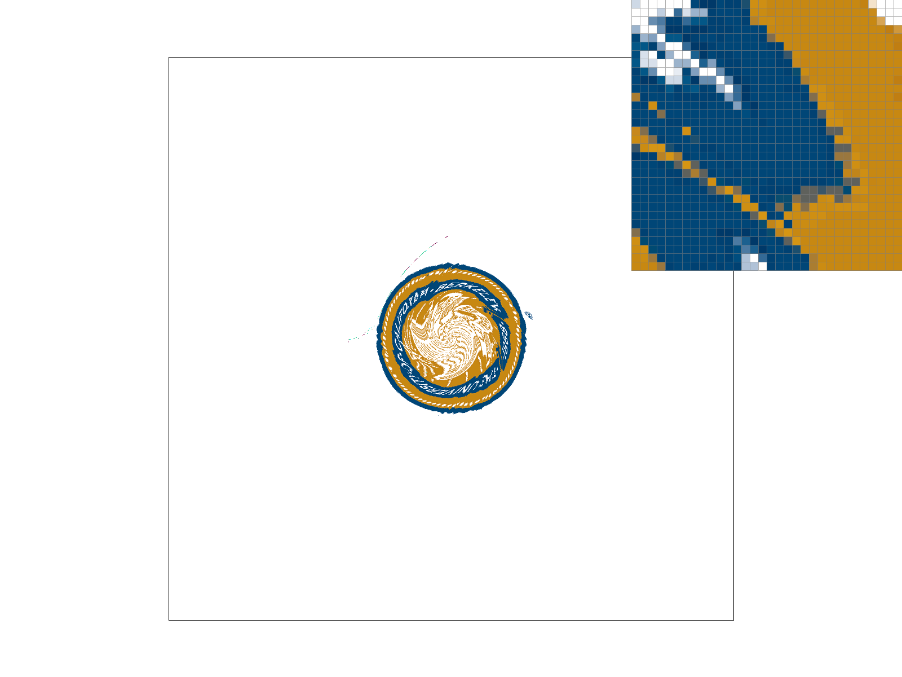

this project focuses on understanding and implementing a rasterization pipeline for rendering triangles. starting with basic triangle rasterization using the point-in-triangle test, we explore more advanced techniques such as supersampling to enhance image quality while maintaining efficiency. to further improve rendering, we incorporate barycentric interpolation for smooth color blending and implement texture mapping using both nearest-neighbor and bilinear interpolation.  

a key theme of this project is balancing efficiency and visual quality in rendering. i never realized how intricate the process of rendering triangles on a screen could be, but working on this project gave me a deep appreciation for the complex mechanics happening behind the scenes of what we see.

## task 1
### how to rasterize the triangles
given that we have vertices:
p0 = (x0, y0)
p1 = (x1, y1)
p2 = (x2, y2)

we can use these points to perform the point-in-triangle test via the three line test to see whether a given point (x_i, y_i) lies between all three vertices. we can compute the three lines (l0, l1, l2) with this equation from the lecture and check whether it is in the triangle with the greater than 0 inequality. in our case, we also consider the points that are on the edge, so we use a greater than or equal to sign 0 sign.

as discussed in lecture and discussion, we know that this equation only works if the winding order is counter-clockwise. if it is clockwise, we need to flip the inequality signs. we can check whether the winding order is counterclockwise by checking the sign of the component along the z-axis (positive for clockwise; negative for counter-clockwise). the component along the z-axis is: (x1 − x0) * (y2 − y1) − (x2 − x1) * (y1 − y0).

however, before we do any rasterization, we can make the computation run a little faster by only computing the smallest possible bounding box around the triangle instead of the entire frame buffer. we do this by setting the bounding box to be the minimums and maximums of the x and y components of the vertices.

here are the results from basic/test4.svg:

    

        
    

    <i>basic/test4.svg with the default viewing parameters and with the pixel inspector centered on an interesting part of the scene</i>

we can see that the triangle renders correctly but there is same aliasing happening where the pixel inspector is hovered over.

## task 2
supersampling is a technique used to reduce aliasing by sampling each pixel multiple times at a higher resolution and then averaging the results to produce a smoother final image. in the rasterization pipeline, i modified the process by introducing a sample_buffer, which stores the supersampled image data (higher-resolution samples per pixel) before downsampling it to the target framebuffer resolution. for each triangle, i subdivided each pixel into a sqrt(sample_rate) × sqrt(sample_rate) grid of subsamples, and for each subsample, i checked whether it was inside the triangle using barycentric coordinates. after rasterizing all the elements, i averaged the subsample colors for each pixel in the sample_buffer and transferred the result to the framebuffer. this effectively smooths the edges of triangles and reduces jagged artifacts, especially when the sample rate is increased.

here are the results from basic/test4.svg at various sampling rates:

    

        
        
        
    

    <i>sampling rate = [1, 4, 16], respectively</i>

as expected, we can see that with a higher sampling rate, we are able to reduce aliasing. the image to the left (sample rate = 1) which is the default sampling rate, contains disjoint entities where the ones on the right are smoothly anti-aliased.

## task 3
i implemented these matrices: translate, scale, and rotate as shown in the lecture slides:

    

        
    

    <i>transformation matrices</i>

after implementing the transformation matrices, i created my own version of the robot:

    

        
    

    <i>my robot is very happy</i>

## task 4
barycentric coordinates help us express any point inside a triangle as a weighted combination of its three vertices. each weight tells us how much influence a vertex has on the point, and the sum of all three weights (alpha, beta, and gamma) is always equal to one. this creates a smooth gradient effect, where the color of each pixel is a blend of the three vertex colors based on its position in the triangle.

this is the color wheel i interpolated:

    

        
    

    <i>color wheel</i>

you can see my example of interpolation on a triangle with three different colored vertices, creating a gradient:

    

        
    

    <i>interpolated triangle with vertices blue, purple, and pink</i>

## task 5
### how i performed texture mapping
to perform texture mapping, i first converted the coordinates in screen space to texture space. then, i performed triangle rasterization similar to the previous parts, but this time, i interpolated with the two methods, nearest and bilinear sampling.

    

        
    

    <i>screen space vs texture space</i>

#### nearest neighbor interpolation
with the nearest neighbor interpolation method, i converted the coordinates into the texture space, rounded the coordinates to the nearest pixel, and sampled it.

#### bilinear interpolation

    

        
    

    <i>bilinear interpolation</i>

with bilinear interpolation, i found the 4 closest pixels and then interpolated both in the horizontal and vertical directions. then, i interpolated the pixel of both those locations to sample.

results:

    

        
        
    

    <i>example of the berkeley seal with nearest sampling and bilinear sampling respectively</i>

    

        
        
    

    <i>nearest sampling at 1 sample per pixel and 16 samples per pixel, respectively</i>

    

        
        
    

    <i>bilinear sampling at 1 sample per pixel and 16 samples per pixel, respectively</i>

we can see that the image with the nearest neighbor sampling method contains rougher edges compared to the one that used the bilinear interpolation method which could look bad at low resolutions. though bilinear interpolation is more computationally expensive, it produces a smoother and more natural transition between edges, almost like anti-aliasing.

## task 6

level sampling in texture mapping determines the appropriate mipmap level based on how much the texture detail changes across a surface. this helps reduce aliasing when textures are viewed at different distances or angles. in our implementation, l_zero always samples from the base texture, l_nearest picks the closest mipmap level, and l_linear blends between two levels for smoother transitions. the tradeoffs involve pixel sampling (sharp vs. smooth textures), level sampling (aliasing vs. detail preservation), and samples per pixel (better antialiasing but higher cost) where trilinear filtering (l_linear + p_linear) offers the best quality but is slower and more memory-intensive. in contrast, nearest-neighbor sampling is faster but prone to artifacts; the choice depends on balancing performance and visual quality.

results:

    

        
    

    <i>l_zero and p_nearest</i>

    

        
    

    <i>l_zero and p_linear</i>

    

        
    

    <i>l_nearest and p_nearest</i>

    

        
    

    <i>l_nearest and p_linear</i>

