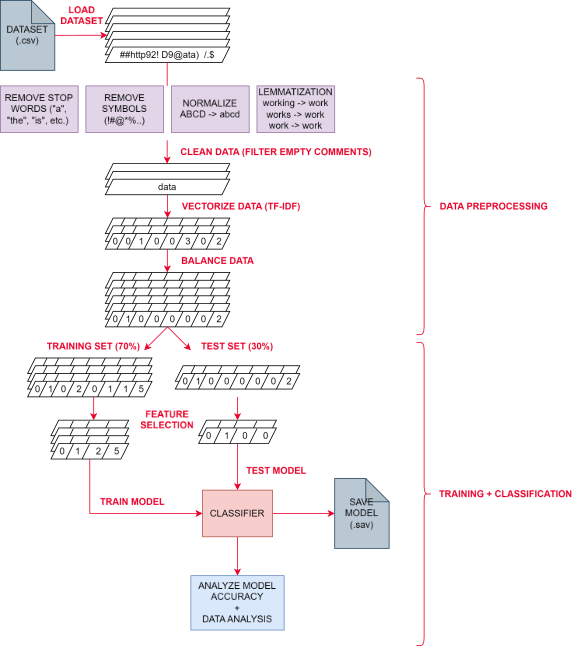
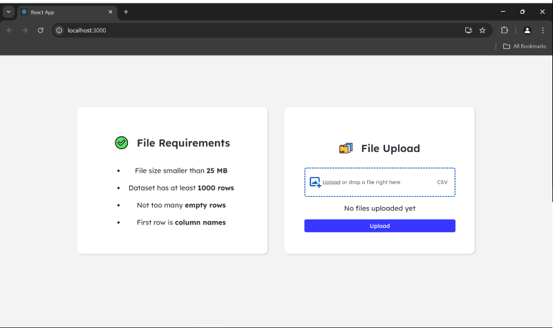
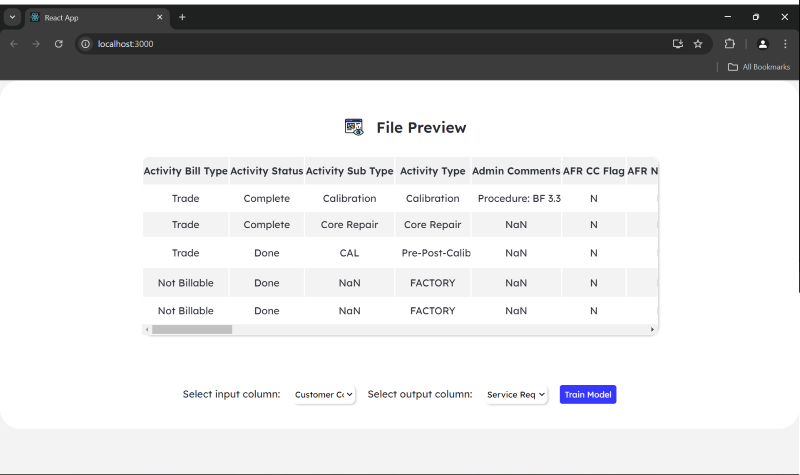
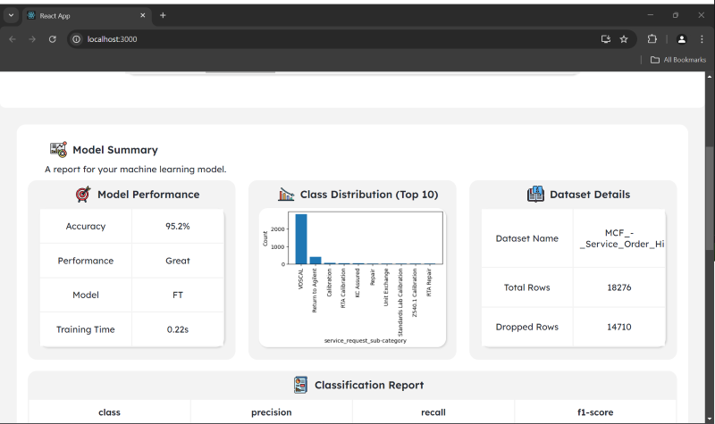
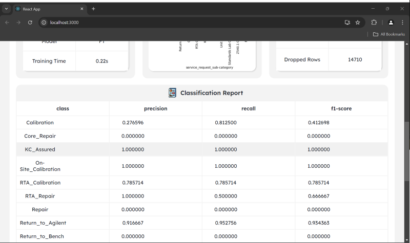
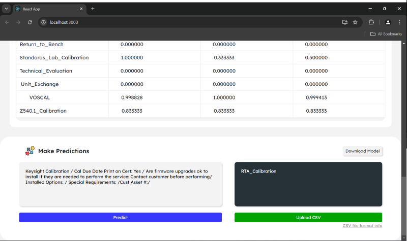

upload your dataset, select your input and target columns, train model, and predict.

## app workflow


## data pipeline + classification workflow



## app preview











## model summary + findings

| algorithm              | accuracy     | training time    | architecture                                                                  | incremental learning    | performance                             | pros                                                           | cons                                |
|------------------------|--------------|------------------|--------------------------------------------------------------------------------|-------------------------|-----------------------------------------|-----------------------------------------------------------------|-------------------------------------|
| multinomial nb         | good         | fast             | probability-based                                                             | ✔                       | efficiently handles large datasets      | fast                                                           | least accurate                      |
| logistic regression    | excellent    | slow             | sigmoid function                                                              | ✖                       | efficiently handles large datasets      | -                                                              | -                                   |
| svm                    | excellent    | slow             | decision boundary                                                             | ✖                       | computationally expensive               | most accurate                                                  | long training                       |
| sgd                    | excellent    | fast             | decision boundary                                                             | ✔                       | -                                       | fast and accurate                                              | -                                   |
| xgboost                | excellent    | slow             | decision trees                                                                | ✖                       | efficiently handles large datasets      | -                                                              | occasionally fails                  |
| cnn                    | excellent    | very slow        | 1d cnn                                                                        | ✖                       | -                                       | very accurate                                                  | hyperparameter tuning takes time    |
| fasttext               | excellent    | fast             | shallow nn model architecture. hierarchical softmax, tree-like structure       | ✖                       | efficiently handles large datasets      | minimalistic; balancing not required; built-in multilabel        | lacks some features                 |

### algorithms used

for this specific application, i chose:

- multinomial nb
- support vector machine (svm)
- stochastic gradient descent (sgd)
- fasttext *by facebook research*

as they were the most efficient and accurate models for a wide variety of datasets.

## folder structure

```
.
└── text-app/
    ├── backend/
    │   ├── csv/
    │   ├── datasets/
    │   ├── downloads/
    │   ├── executions/
    │   ├── logger.py
    │   ├── server.py
    │   └── sharepoint.py
    ├── build/
    ├── env/
    ├── logs/
    ├── node_modules/
    ├── public/
    │   └── assets/
    ├── screenshots/
    ├── src/
    │   └── components/
    ├── .env
    ├── .gitignore
    ├── config.ini
    ├── package-lock.json
    ├── package.json
    ├── README.md
    └── requirements.txt
```

## linking with sharepoint

this app can be configured to store the files in sharepoint or on the server (local). to switch to sharepoint storage, set `sharepoint` in `config.ini` under the section `storage` to `true`. similarly, you can set it to `false` to use server storage.

this is the *redacted*.

### sharepoint folder structure

```
.
└── sites/
    └── text-classification/
        └── Shared Documents/
            ├── executions/
            ├── datasets/
            ├── csv/
            └── config.ini
```

*note: do not change configuration during the execution. this will cause errors!*

## how to use

### prerequisites

- install [node.js](https://nodejs.org/en)
- install npm (node package manager)

### create react app

change to project directory `cd <repo-name>`

create react app `npx create-react-app .`

copy over all the files in the bitbucket into the app you just created.

find more information on creating a [react app](https://create-react-app.dev/docs/getting-started).

### install dependencies for react front-end

    npm install @lottiefiles/react-lottie-player
    npm install axios
    npm install csv-parser
    npm install fs
    npm install papaparse
    npm install react-csv-reader
    npm install react-drag-drop-files
    npm install react-tooltip

your `package.json` should look something like this:

    "proxy": *redacted*,
    "dependencies": {
        "@lottiefiles/react-lottie-player": "^3.5.4",
        "@testing-library/jest-dom": "^5.17.0",
        "@testing-library/react": "^13.4.0",
        "@testing-library/user-event": "^13.5.0",
        "axios": "^1.7.2",
        "csv-parser": "^3.0.0",
        "fs": "^0.0.1-security",
        "papaparse": "^5.4.1",
        "react": "^18.3.1",
        "react-csv-reader": "^4.0.0",
        "react-dom": "^18.3.1",
        "react-drag-drop-files": "^2.3.10",
        "react-scripts": "5.0.1",
        "react-tooltip": "^5.27.1",
        "web-vitals": "^2.1.4"
    }

*note: the versions above might be different to yours*

### install dependencies for flask back-end

`pip install -r requirements.txt`

### starting the front-end (react)

`npm start` runs the app in the development mode. open [http://localhost:3000](http://localhost:3000) to view it in your browser.

### starting the back-end (flask api)

by default, the app is connected to the api hosted on the server at *redacted*.

you can use a locally hosted api by running `python backend/server.py` and it will be hosted at [http://localhost:5000](http://localhost:5000). do note that you will have the change the endpoint url in each component file in `src/components` via the `apiurl` variable to point to this local host. this can be done through editing the global variable in the `.env` file.

*notes:*
- *make sure to use a semicolon ";" to comment out lines in the .env file*
- *if using the server-hosted api, the `config.ini` file on the server is the one that will be used. otherwise, it will use config.ini on your local machine.*

## deployment/changing production code

1. update changes to the files on the server (changes made locally must be reflected on the server)
2. run `npm run build` in local machine
3. make sure to copy the latest `build` file to the server

you can find the deployed app at *redacted*

see the section about [deployment](https://facebook.github.io/create-react-app/docs/deployment) for more information.
